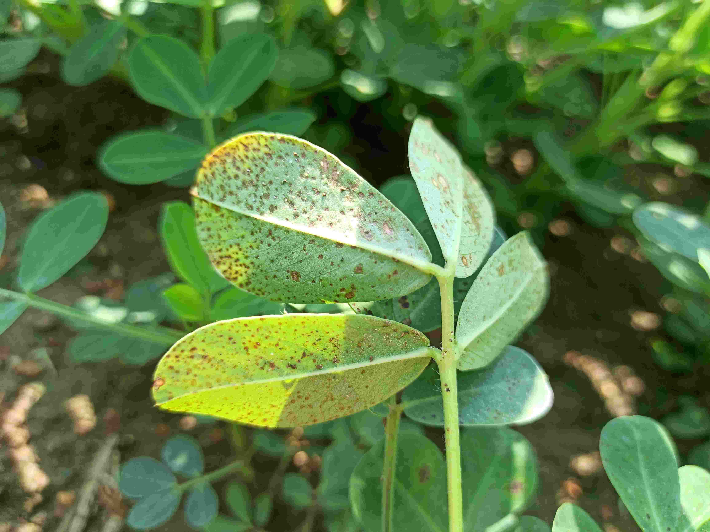

<h1 align="center"> 🌿 Groundnut Leaf Disease Detection Using Vision Transformer (ViT) in PyTorch </h1>

This repository provides a complete pipeline for detecting groundnut (peanut) leaf diseases using Vision Transformer (ViT) models. The solution is developed using PyTorch and fine-tuned on a custom high-resolution dataset of healthy and diseased groundnut leaves collected from West Bengal, India.

## 🧾 Project Overview
<div align="center">

| Attribute              | Description                                                                 |
|------------------------|-----------------------------------------------------------------------------|
| 📚 Framework           | PyTorch, Torchvision, Timm                                                   |
| 🧠 Models Used         | Vision Transformer (ViT)          |
| 📷 Input Format        | JPEG Images (224×224 px)                                                     |
| 🎯 Output              | 5-Class Image Classification                                                 |
| 🧪 File                | `vit-code.ipynb`                                                  |
| 📁 Dataset Source      | [Mendeley Dataset](https://data.mendeley.com/datasets/x6x5jkk873/1)          |

</div>

## 🗂 Dataset Overview

This dataset contains a total of **1,720 images** of groundnut leaves collected from **Purba Medinipur, West Bengal, India**, across five categories. Images are high-resolution (~4624×3472 px) and organized into class-wise folders.

### 📊 Class Distribution

<h3 align="center">📊 Class Distribution</h3>

<table align="center">
  <tr>
    <td align="center"></td>
    <td align="center"></td>
    <td align="center"></td>
    <td align="center"></td>
    <td align="center"></td>
  </tr>
  <tr>
    <td align="center"><b>Healthy</b></td>
    <td align="center"><b>Alternaria Leaf Spot</b></td>
    <td align="center"><b>Leaf Spot</b></td>
    <td align="center"><b>Rust</b></td>
    <td align="center"><b>Rosette</b></td>
  </tr>
</table>


- Total Images: **1,720**
- Format: `.jpg` (~4624×3472 resolution)
- Directory Structure: Class-wise folders
- Split: 80% train / 20% test using `Subset` and `train_test_split`


## 🧪 Notebook Workflow
<div align="center">
  
| Step                | Description                                                                 |
|---------------------|-----------------------------------------------------------------------------|
| 📥 Data Loading      | Loaded with `torchvision.datasets.ImageFolder` and custom transforms        |
| 🧼 Preprocessing      | Resize → ToTensor → Normalize (ImageNet stats)                             |
| 🧠 Model              | Vision Transformer `vit_b_16`, pre-trained on ImageNet, fine-tuned head     |
| 🛠️ Fine-Tuning        | Only classification head (`model.heads.head`) is trainable                 |
| 🔁 Training           | 20 epochs using `CrossEntropyLoss` + `Adam` optimizer                       |
| 📊 Evaluation         | Accuracy, precision, recall, F1-score, confusion matrix                     |
| 🔍 Inference          | Custom `predict_image()` function for single image classification           |

</div>

---


<h2>⚙️ Model Configuration &nbsp;&nbsp;&nbsp;&nbsp;&nbsp; 📈 Epoch-wise Performance</h2>
<div align="center">
<table>
  <tr>
    <td>

<!-- Left Table -->
<b>⚙️ Model Configuration</b>

<table>
  <tr><th>Parameter</th><th>Value</th></tr>
  <tr><td>Input Image Size</td><td>224 × 224</td></tr>
  <tr><td>Pretrained Weights</td><td>ImageNet-1k</td></tr>
  <tr><td>Trainable Layers</td><td>Classification Head only</td></tr>
  <tr><td>Epochs</td><td>20</td></tr>
  <tr><td>Batch Size</td><td>32</td></tr>
  <tr><td>Learning Rate</td><td>0.001</td></tr>
  <tr><td>Optimizer</td><td>Adam</td></tr>
  <tr><td>Loss Function</td><td>CrossEntropyLoss</td></tr>
</table>

  </td>
  <td style="width: 40px;"></td>
  <td>

<!-- Right Table -->
<b>📈 Epoch-wise Performance</b>

<table>
  <tr><th>Metric</th><th>Value</th></tr>
  <tr><td>🧪 Final Test Accuracy</td><td><b>96.80%</b></td></tr>
  <tr><td>🌟 Peak Test Accuracy</td><td><b>97.38%</b> (Epoch 19)</td></tr>
  <tr><td>📉 Final Test Loss</td><td><b>0.1317</b></td></tr>
  <tr><td>🔁 Total Epochs</td><td>20</td></tr>
</table>

  </td>
  </tr>
</table>
</div>

---

## 🔍 Confusion Matrix & Loss Curve

Visual summaries of model performance and training convergence:

<p align="center">
  
  
</p>

---


## ✅ Conclusion

This project successfully demonstrates how Vision Transformer (ViT), when fine-tuned on a high-resolution groundnut leaf dataset, can achieve high classification performance in detecting common diseases such as:

- **Alternaria Leaf Spot**
- **Leaf Spot**
- **Rust**
- **Rosette**
- **Healthy**

The model achieves a test accuracy of up to **97.38%**, showing strong potential for real-world agricultural applications, especially for early-stage disease detection in crops.

---

## 🔮 Future Improvements

Some suggested enhancements to this project include:

- 🖼️ **Real-time leaf disease detection** using OpenCV and webcam integration  
- 📈 **Data augmentation strategies** like mixup, cutmix, and elastic distortions  
- 🧠 **Model explainability** with Grad-CAM to highlight decision areas on leaves  
- ☁️ **Deploy the model** via Flask, FastAPI, or Streamlit for web/mobile apps  
- 🔁 **Automated retraining** pipeline using newly collected field data  
- 🧪 Experiment with **ViT variants** like `vit_b_32`, `deit`, or `swin_transformer`

---

## 🚀 How to Execute This Project

Follow the steps below to clone and run this project on your machine:

#### 1️⃣ Clone the Repository

```bash
git clone https://github.com/suman2896/neemleaf-vit.git
cd neemleaf-vit
```
---
2️⃣ Install Required Libraries
Make sure Python 3.8+ is installed. Then install the dependencies using:

```bash
pip install -r requirements.txt
```
✅ All required packages (including PyTorch, torchvision, timm, matplotlib, scikit-learn, etc.) are listed in the requirements.txt.

3️⃣ Download the Dataset
Go to the official Mendeley Dataset, download it, and extract the contents.
[Mendeley Dataset](https://data.mendeley.com/datasets/x6x5jkk873/1)

---

4️⃣ Run the Notebook
Use Jupyter Notebook or any compatible environment to execute the code:
```bash
jupyter notebook vit-code-pretrained.ipynb
```
The notebook covers:

✅ Data loading and preprocessing  
✅ Vision Transformer (ViT) fine-tuning  
✅ Model evaluation with accuracy, loss, F1-score  
✅ Visualization of confusion matrix and loss curve  
✅ Single image prediction with `predict_image()`

---


## 📊 Features

- Vision Transformer (ViT) model implemented for detection 
- Patch embedding layer to convert images into token sequences  
- Positional encoding and multi-head self-attention  
- Configurable training loop with optimizer and loss function  
- Training and validation loss/accuracy plots  
- Confusion matrix and classification report  


## 🤝 Contributing

Contributions are welcome! Feel free to fork the repo and submit a pull request.  
For any issues or feature requests, please open an [issue](https://github.com/your-username/your-repo/issues).
